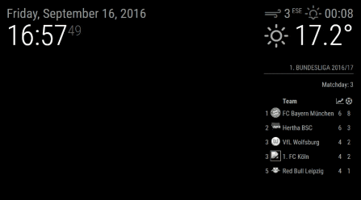

# MMM-ModuleScheduler
A MagicMirror helper module to schedule when modules should be shown, hidden or dimmed and when notifications should be sent.



## Installation

In your terminal, go to your MagicMirror's Module folder:
````
cd ~/MagicMirror/modules
````

Clone this repository:
````
git clone https://github.com/ianperrin/MMM-ModuleScheduler.git
````

Go to the modules folder:
````
cd MMM-ModuleScheduler
````

Install the dependencies:
````
npm install
````

Add the module to the modules array in the `config/config.js` file:
````javascript
    {
        module: 'MMM-ModuleScheduler'
    },
````

## Config Options
| **Option** | **Default** | **Description** |
| --- | --- | --- |
| `schedulerClass` | 'scheduler' | **Optional** The name of the class which should be used to identify those modules which have a schedule. |
| `animationSpeed` | 1000 | **Optional** The speed of the show and hide animations in milliseconds |
| `notification_schedule` |  | **Optional** A single, or array of multiple definitions to schedule when notifications should be sent. See [Scheduling Notifications](#scheduling-notifications)  |

## Config Examples

### Scheduling Notifications
To schedule the sending of a notification to other modules, add a `notification_schedule` definition to the MMM-ModuleScheduler config, e.g.
````javascript
    {
        module: 'MMM-ModuleScheduler',
		config: {
			// SHOW AN ALERT AT 09:30 EVERY DAY (see https://github.com/MichMich/MagicMirror/tree/develop/modules/default/alert)
			notification_schedule: {
				notification: 'SHOW_ALERT', 
				schedule: '30 9 * * *', 
				payload: {
					type: "notification", 
					title: 'Scheduled alert!'
				}
			}
		}
    },
````
**Notes** 
* `notification` is required and should be the identifier of the notification to be sent to all other modules. 
* `schedule` is required and determines when the notification will be sent. It should be a valid cron expression - see [crontab.guru](http://crontab.guru/). 
* `payload` is optional and its contents will be determined by the module receiving the notification. 

### Scheduling Multiple Notifications
Multiple `notification_schedule` definitions can be added using an array, e.g.

````javascript
    {
        module: 'MMM-ModuleScheduler',
		config: {
			notification_schedule: [
				// SHOW AN ALERT AT 07:30 EVERY DAY
				{notification: 'SHOW_ALERT', schedule: '30 7 * * *', payload: {type: "notification", title: 'Good morning!'}},
				// SHOW AN ALERT AT 17:45 EVERY DAY
				{notification: 'SHOW_ALERT', schedule: '17 45 * * *', payload: {type: "notification", title: 'Good afternoon!'}}
			]
		}
    },
````

### Scheduling actions to control your MagicMirror, Pi and monitor/screen
Used in conjunction with [MMM-Remote-Control](https://github.com/Jopyth/MMM-Remote-Control) module, the `notification_schedule` definitions can create schedules to control your MagicMirror, Pi and monitor/screen, e.g.

````javascript
    {
        module: 'MMM-ModuleScheduler',
		config: {
			notification_schedule: [
				// TURN THE MONITOR/SCREEN ON AT 07:30 EVERY DAY
				{notification: 'REMOTE_ACTION', schedule: '30 7 * * *', payload: {action: "MONITORON"}},
				// TURN THE MONITOR/SCREEN OFF AT 22:30 EVERY DAY
				{notification: 'REMOTE_ACTION', schedule: '30 22 * * *', payload: {action: "MONITOROFF"}},
				// RESTART THE MAGICMIRROR PROCESS AT 2am EVERY SUNDAY
				{notification: 'REMOTE_ACTION', schedule: '0 2 * * SUN', payload: {action: "RESTART"}}
			]
		}
    },
````
**Notes** 
* A full list of remote actions available for controlling your MagicMirror, Pi and monitor/screen are available in the [MMM-Remote-Control module documentation](https://github.com/Jopyth/MMM-Remote-Control#list-of-actions)
* If you simply want to hide and show modules, it is recommended to use the module display scheduling options defined below, rather than the `SHOW` and `HIDE` remote actions. 

### Scheduling Module Display
To schedule when a module is shown (or hidden) by the Magic Mirror, modify the configuration for that module so that it includes the `classes` and `module_schedule` options. e.g. 
````javascript
	{
		module: 'clock',
		header: 'US Holidays',
		position: 'top_left',
		classes: 'scheduler',
		config: {
			// DISPLAY THE CALENDAR BETWEEN 09:00 and 18:00 ON WEDNESDAYS
			module_schedule: {from: '0 9 * * 3', to: '0 18 * * 3' },
			calendars: [
				{
					symbol: 'calendar-check-o ',
					url: 'webcal://www.calendarlabs.com/templates/ical/US-Holidays.ics'
				}
			]
		}
	},
````
**Notes** 
* `from` is required and determines when the module will be shown. It should be a valid cron expression - see [crontab.guru](http://crontab.guru/). 
* `to` is required and determines when the module will be hidden. It should be a valid cron expression - see [crontab.guru](http://crontab.guru/). 

### Dimming Modules
To dim a module, rather than hide it, set the `dimLevel` option (as a percentage between 0 and 100), to the `module_schedule` definition. e.g.
````javascript
	{
		module: 'clock',
		position: 'top_left',
		classes: 'scheduler',
		config: {
			// DISPLAY BETWEEN 06:30 AND 22:30 AND DIM IT TO 25% AT ALL OTHER TIMES 
			module_schedule: {from: '30 6 * * *', to: '30 22 * * *', dimLevel: '25'}
		}
	},
````
**Note:** 
* The module will be shown (full brightness) based on the `from` expression
* The will then either be hidden (or dimmed if the `dimLevel` is set) based on the `to` expression. 

### Multiple Schedules
For more complex scheduling, multiple `module_schedule` definitions can be added using an array, e.g. 
````javascript
	{
		module: 'clock',
		position: 'top_left',
		classes: 'scheduler',
		config: {
			// DISPLAY BETWEEN 09:30 ON SATURDAYS AND 22:30 ON SUNDAYS, 
			//THEN AGAIN BETWEEN 20:00 AND 23:00 ON TUESDAYS AND WEDNESDAYS 
			module_schedule: [
				{from: '30 9 * * SAT', to: '30 22 * * SUN'}, 
				 {from: '0 20 * * 2-3', to: '0 23 * * 2-3'}
			]
		}
	},
````

## Updating

To update the module to the latest version, use your terminal to go to your MMM-ModuleScheduler module folder and type the following command:

````
git pull
```` 

If you haven't changed the modules, this should work without any problems. 
Type `git status` to see your changes, if there are any, you can reset them with `git reset --hard`. After that, git pull should be possible.
